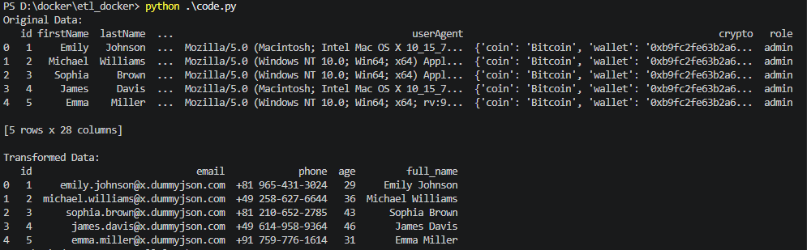
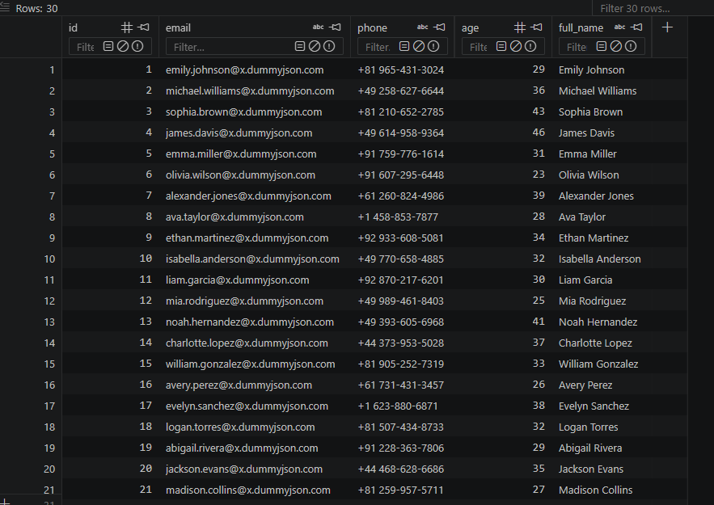
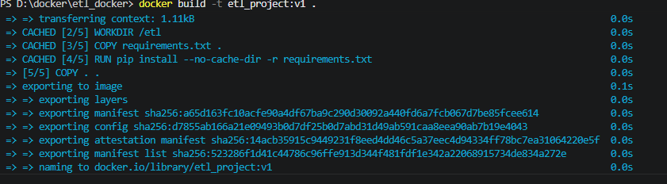
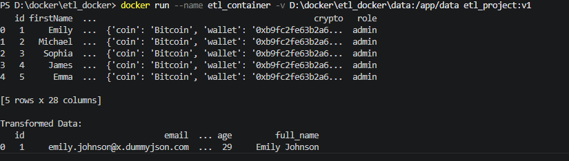

# 🚀 ETL Docker Project

A production-style ETL pipeline built with Python and Docker that extracts user data from a public API, transforms it using Pandas, and loads it into a SQLite database with persistent storage using Docker Volumes.

---

## 📌 Overview

This project demonstrates a complete ETL workflow:

- 🔹 Extract: Fetch data from a public REST API
- 🔹 Transform: Clean and structure data using Pandas
- 🔹 Load: Store processed data into SQLite database
- 🔹 Containerized using Docker for portability and reproducibility

---

## ⚙️ Tech Stack

- Python 3.11
- Pandas
- Requests
- SQLite
- Docker

---

## 📁 Project Structure

etl_docker/
│
├── app.py              # Main ETL pipeline script
├── requirements.txt    # Python dependencies
├── Dockerfile          # Docker build configuration
├── .dockerignore       # Files excluded from image
├── .gitignore          # Files excluded from Git
└── data/               # Output database (via volume)


---

## 🔄 ETL Workflow

### 1️⃣ Extract
Data is fetched from a public API:

    https://dummyjson.com/users


---

### 2️⃣ Transform
Using Pandas:
- Select required columns
- Create `full_name`
- Remove unnecessary fields

---

### 3️⃣ Load
Data is stored into a SQLite database:
/app/data/users.db


Persisted using Docker Volumes.

---

## 🐳 Run with Docker

### 1. Build Image
```bash
docker build -t etl-project:v1 .

2. Run Container (with Volume)

docker run --name etl_container -v D:\docker\etl_docker\data:/app/data etl-project:v1


📸 Screenshots
🖥️ 1. Running the ETL Pipeline in Docker

Shows the container execution and printed transformed data from the API.


📂 2. Generated Database File on Host Machine

Displays the users.db file created inside the local data/ folder using Docker Volume mapping.

🗄️ 3. Inspecting Data inside SQLite Database

Shows the structured data inside SQLite using DB Browser or equivalent tool.

🐳 4. Docker Image Successfully Built

Confirms that the ETL project image was created successfully.

📦 5. Docker Container Execution

Shows the container lifecycle and successful execution of the ETL pipeline.

💡 Key Concept

Docker ensures:

Same environment across all machines
No dependency issues
Easy deployment of ETL pipelines
📌 Notes
Database file is persisted using Docker Volumes
Container is stateless; data is stored outside container
Each run produces consistent ETL output
👨‍💻 Author

Built as a Data Engineering learning project.
